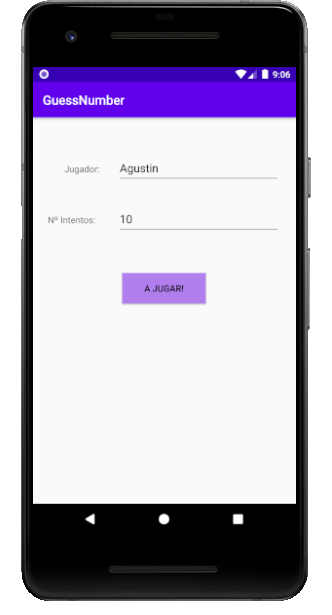
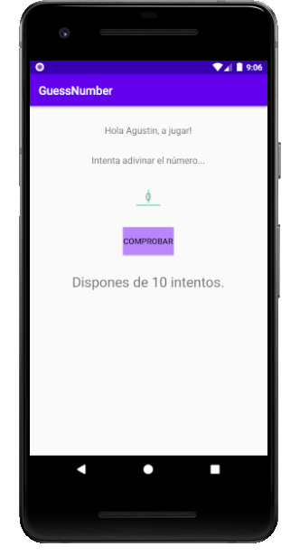
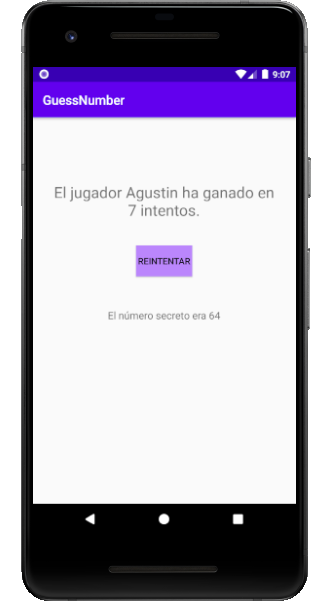

# Proyecto GuessNumber Agustín Muñoz Jimenez
Proyecto el cual se basa en que el Jugador debe acertar un número secreto generado aleatoriamente entre 1 y 100. 
Dispone de tres Activities. En la primera, el usuario debe introducir su nombre y el número de intentos de los que dispondrá.
En la segunda, el usuario debe intentar adivinar el número secreto y cada vez que este falle tendrá la opción de reintentarlo.
En la tercera, se muestra el resultado del juego, es decir, si ha ganado o ha perdido y en cuantos intentos; también contaremos con la opción de volver a empezar el juego.
 
Tenemos un clase Jugador que dispone de todos los campos necesarios para el juego. Para manipular los datos del jugador en las diferentes Activities emplearemos la clase
GuessNumberApplication que hereda de Application. Esta clase se encarga de instanciar un objeto de la clase Jugador y facilita los métodos necesarios para editar dicho objeto
y recogerlo en cualquier Activity.
 
Todos los errores están controlados y para informar de ello al usuario he empleado la clase Toast y su método makeText().
 
A la hora de jugar, si el usuario no acierta el número secreto, le doy una pequeña pista sobre su fallo mediante el control AlertDialog.
 
Este control es muy interesante, ya que nos lanza un cuadro de diálogo que podremos editar a nuestro antojo.
 
 
Qué puedes aprender con este proyecto?:
* Control de errores básico
* Clase Toast y su método makeText().
* Patrón SINGLETON
* Control AlertDialog
* Manejo de Activities
 
 
Imagen de la primera Activity:

Imagen de la segunda Activty:

Imagen de la tercera Activty:

